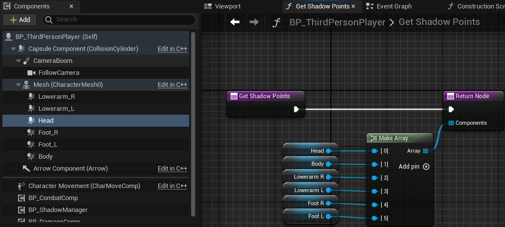
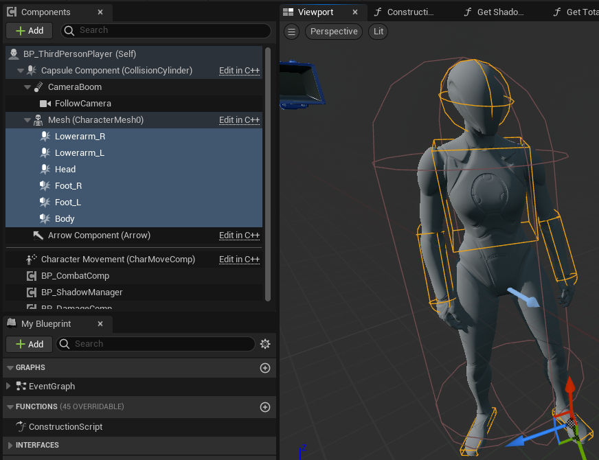
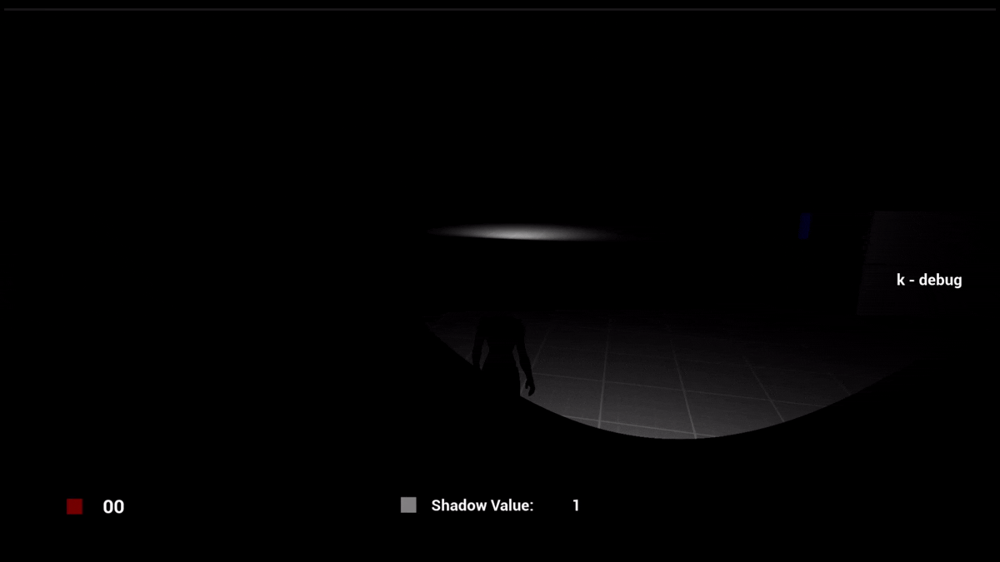
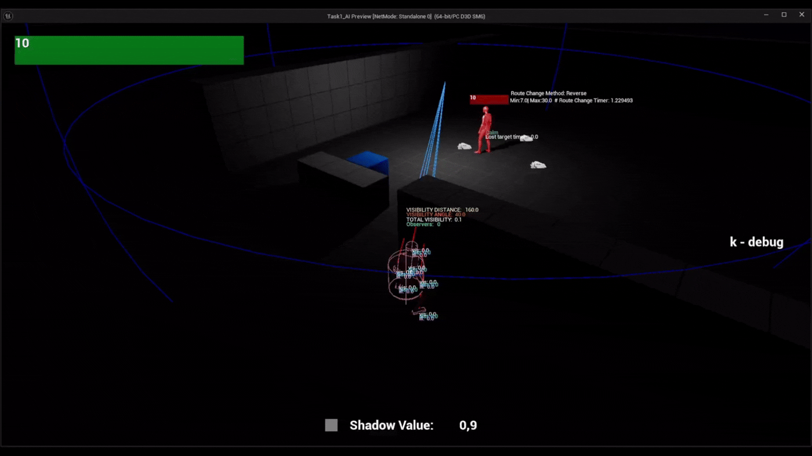
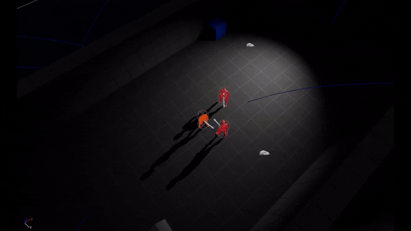
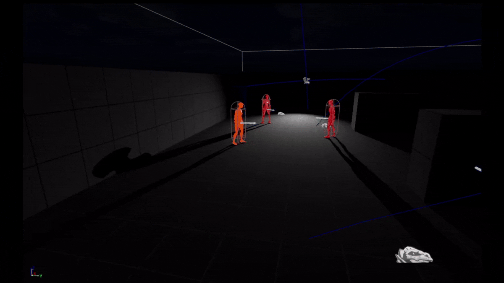
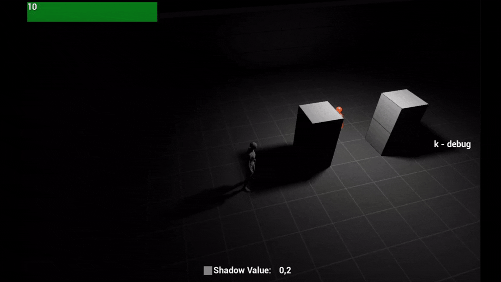

# Task1_AI

Почти все сделано на блюпринтах.

## Определение уровня освещённости персонажа

Отраженное освещение не учитывается.

Расчет видимости учитывает Light falloff, Intensity и дальность от источника света.

Уровень освещённости расчитывает "Shadow Manager" (Actor component), используя коллайдеры которые присоеденяются к сокетам в skeletal mesh. Доступ к коллайдерам влияющим на видимость осуществляется через интерфейс функцию "Get_ShadowPoints", которая должна быть реализована у владельца компонента "Shadow Manager".
 

Если коллайдеры попадают в поле видимости ИИ или пересекаются с коллайдером источника света, для каждого из них рассчитывается значение видимости, после чего вычисляется среднее арифметическое этих значений.
Допустим, всего есть 6 коллайдеров, но в область света попали только коллайдеры головы и руки. Для головы значение видимости составило 0.6, а для руки — 0.5.

(0.6 + 0.5 + 0 + 0 + 0 + 0) / 6 = 0.18

 

### Источники света
Пока что размер источника света не учитывается.

Коллайдер влияющий на расчёт освещённости автоматически подстраивается под параметры источника света.

Пока что для расчёта видимости доступны только эти источники света:
- Point light
- Spot light
- Rect light 

## Система "Свой/Чужой"

Используются GameplayTags. 

Если у актора есть тег Team.NotValid, то его будут игнорировать.
## Поведение AI
Для каждого NPC можно назначить свой behaviour tree в параметре “BT_Default”.

NPC в некоторых ситуациях могут реагировать на состояние наблюдаемого союзника. 
Например, если NPC видит, что союзник вступил в бой, он сделает то же самое.
Или если NPC, находясь в состоянии покоя, замечает союзника в состоянии отступления, он начинает поиск противника на последней локации где его было видно.

### Патрулирование и смена маршрута
Патрулирование происходит по точкам.

Смена маршрута с случайным интервалом.

Интервал смены маршрута патрулирования берется из параметров компонента “Patrol_Comp” (MinInterv_RouteChange, MaxInterv_RouteChange) или указывается в таске behaviour tree.

Способ смены маршрута также берется из параметров компонента или указывается в таске behaviour tree.
Способы смены маршрута: 
- **PatrolRoute_NotChange**
- **Use_CurrentValueOfPatrolComp** - (Вариант только для behaviour tree task) Каждый актор будет использовать параметр под названием "Patrol_Route_Change_Method" из своего “Patrol_Comp”
- **Pick_Random_Method** - Выбирает случайный способ, исключая "PatrolRoute_NotChange" и "Use_EditableValueOfPatrolComp".
- **Shuffle**
- **Reverse**

### Осмотр объекта
Это состояние может прерватся при обнаружении противника.

### Имитация диалога

Разговор также может прерватся при обнаружении противника.

### Реакция на шум

Для реакции на шум используются значения из таблицы "DT_SenseHandle" 
- **Hear_MaxDist** - максимальный радиус для реакции на шум 
- **Hear_MaxDist_TriggerRun** - максимальный радиус для перехода в режим бега.

При шуме от **выстрелов** учитывается только максимальная дальность слуха из perception component, а значения из data table **игнорируются**.

### Melee AI (ближний бой)
При получении урона есть вероятность отступления.

### Ranged AI (дальний бой)
Перед выстрелом проверяет есть ли на пути союзник(sphere trace желтого цвета).

Прячется за укрытие если атака в кулдауне и выглядывает чтобы выстрелить.

Пытается держать дистанцию если рядом нету укрытий.

