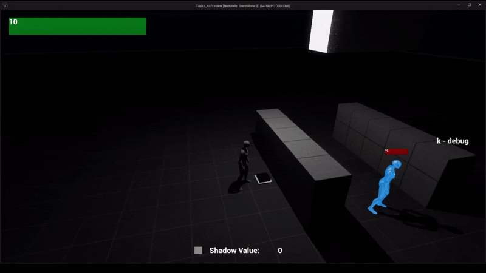
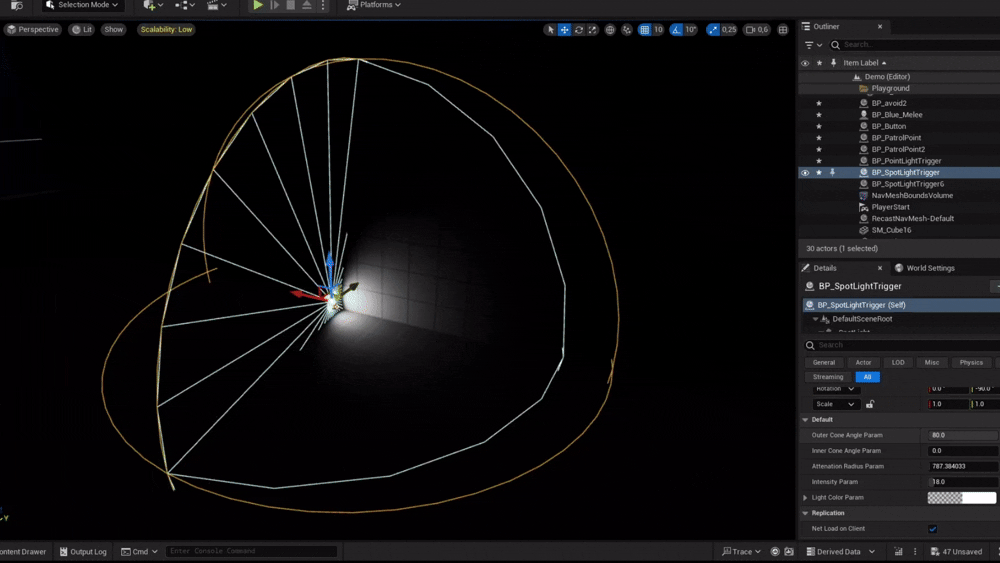

# Task1_AI

=)

## Смена маршрута

## Определение уровня освещённости персонажа

### Источники света
Коллайдер влияющий на расчёт освещённости автоматически подстраивается под параметры источника света.

- Point light

- Spot light

- Rect light 

## Реакция на шум
## Система "Свой/Чужой"
## Мирное поведение
